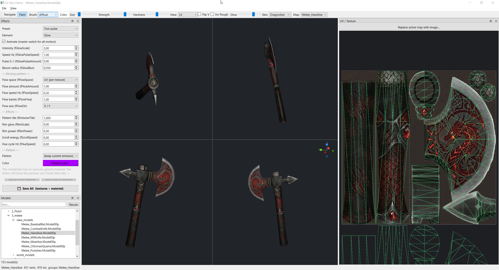
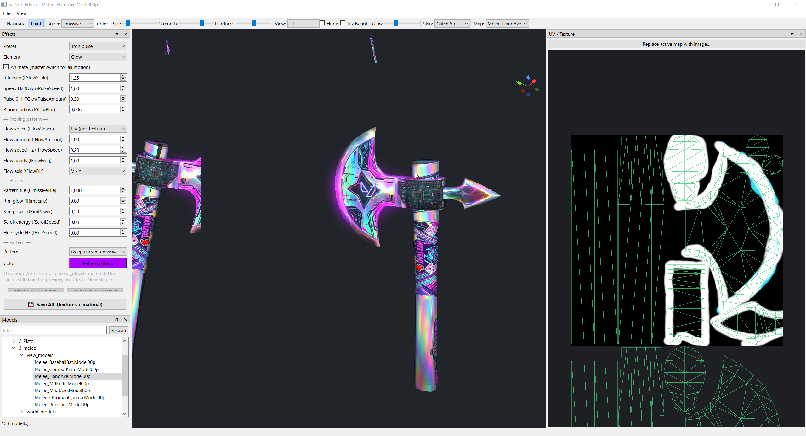

# skin_edit — animated weapon skins & effects for S2 / District 187

Reskin S2 SonSilah / District 187 weapons **and give them animated glow, fire and
lightning effects** — all from a desktop GUI, with a live 3D preview that matches in‑game.
Paint a skin, drop a pattern, pick a color, choose an effect, and save a ready‑to‑use
material + textures.




> Animated emissive glow on a PDW (live preview):
>
> 

---

## What you get

- **Skin editor** — load a weapon, paint diffuse / normal / roughness / spec / emissive
  directly on the model and on a 2D UV panel, or import your own art per map.
- **Animated effect shaders** (drop‑in, no per‑skin coding):
  - **Glow** — pulsing emissive that blooms, with a moving **flow** band, **scrolling**
    patterns, **fresnel rim**, **hue cycle** and a color **tint**.
  - **Fire** 🔥 — scrolling flame‑noise through a fire color ramp, with flicker.
  - **Lightning** ⚡ — flashing branching arcs that fade out and re‑strike at new spots.
- **Ready patterns** — tileable emissive textures (grid, dots, stars, hex‑ish, stripes,
  flame, lightning…) you can drop onto any skin and tile / scroll / recolor.
- **Effect presets** — one‑click looks (Soft pulse, Energy flow, Rainbow, Tron, …).
- **One‑click save** — writes all textures (compiled to DXT5 `.dds`) **and** the
  `.Mat00` materials (incl. first‑/third‑person sibling views) for the chosen effect.

---

## Install

### 1. The editor (Python)

Requires **Python 3**. From this folder:

```
pip install -r requirements.txt
```

(`numpy` and `Pillow` are assumed present, as with the other tools.)

Run it:

```
py skin_edit.py --game-root "<path-to>/Game"
```

or `skin_edit.bat <model>` on Windows. `--game-root` is the folder that contains
`weapons/` (the game's `Game` directory). You can also set it later from
**File ▸ Set Game Root…** (Ctrl+G), or via the `S2_GAME_ROOT` environment variable.

### 2. The effect shaders (one‑time, in the game)

The animated effects use three custom shaders. **Precompiled** `.fxo` files are included,
so most people just copy them in:

```
copy  shaders\*   →   <your game>\Game\shaders\
```

i.e. copy the bundled `shaders/skeletal/Solid/specular_{glow,fire,electric}.fxo` and
`shaders/rigid/Solid/...` into the matching folders under your game's `Game\shaders\`.
(The game loads compiled `.fxo` from `Game\shaders\`.)

> **Recompiling (optional).** To rebuild from the `.fx` sources you need the legacy
> `fxc.exe` from the **DirectX SDK (June 2010)** — the modern Windows‑SDK `fxc` dropped
> the `fx_2_0` profile these shaders use. Example:
> `fxc /T fx_2_0 /Fo specular_glow.fxo specular_glow.fx`

---

## Tutorial — make a glowing / burning / electrified skin

1. **Open a weapon.** *Models* dock (left) → double‑click a `.Model00p`, or
   **File ▸ Open Model…**. Orbit/pan/zoom in the 3D panes; drag the dividers to resize,
   **Tab** to maximize a pane.

2. **Paint or import the skin.** Pick a brush mode in the toolbar (diffuse / brightness /
   spec / normal / roughness / **emissive**) and paint on the **UV / Texture** panel, or
   **File ▸ Replace active map with image…** (Ctrl+R) to import a PNG/DDS — choose which
   map (e.g. *emissive*) to replace.

3. **Choose where it glows.** The **emissive** map is the effect mask: bright areas
   glow/burn/spark, black areas don't. Paint it by hand (emissive brush), auto‑generate it
   (**File ▸ Generate Glow (Emissive) Map from Diffuse…**), or use a **Pattern** (below).

4. **Open the *Effects* panel** (right dock) and pick an **Element**:
   - **Glow** — steady/pulsing emissive bloom. Dial **Intensity**, **Pulse**, and the
     extras: **Flow** (a band sweeping across), **Scroll energy**, **Rim glow**,
     **Hue cycle**, **Pattern tile**.
   - **Fire 🔥** / **Lightning ⚡** — auto‑loads its source texture (`flame` / `lightning`)
     into the emissive and sets sensible defaults. Tune **Speed**, **Pulse** (flicker /
     strike frequency), **Pattern tile** (scale), **Intensity**.

5. **Patterns & color.**
   - **Pattern** dropdown drops a ready tileable texture onto the emissive (grid, dots,
     stars, stripes, flame, lightning…). **Pattern tile** changes its size; **Scroll
     energy** makes it flow.
   - **Pattern color…** tints the (white) pattern any color. **Hue cycle** animates the
     color through a rainbow instead.
   - **Presets** dropdown applies a whole ready‑made look in one click.

6. **Preview it live.** Toggle **Animate** to play the pulse/flow/fire/lightning in the
   viewport. The preview mirrors the in‑game shader.

7. **Save.** **💾 Save All (textures + material)** (or Ctrl+S) writes every texture
   (compiled to `.dds`) **and** the `.Mat00` material(s) — retargeted to the chosen effect
   shader with your settings — under an output folder (asked once, remembered after). It
   also writes the first‑/third‑person/part **sibling** materials so the skin shows in all
   views.

8. **Install the skin.** Copy the saved output tree into your game (it mirrors the game's
   folder layout), then select the skin in‑game. The custom effect shaders must be present
   (see *Install ▸ 2*).

> Tip: effects animate from the engine's frame time. If an animated effect looks frozen
> in‑game after updating a shader, fully **restart the game** — the engine caches compiled
> shaders and a map reload reuses the cached copy.

---

## Patterns

Bundled tileable emissive patterns live in `patterns/` (and are copied to
`Game\Tex\Patterns\` for in‑game reference): `grid_fine`, `grid_square`, `grid_tron`,
`dots`, `rings`, `cross`, `checker`, `diagstripes`, `chevron`, `stars`, `triangles`,
`flame`, `lightning`. They're white‑on‑black and seamless, so they tile, scroll and tint
cleanly. Use the **Pattern** dropdown, or import one as the emissive via Ctrl+R.

## Effect shaders

| Shader | Effect | Source texture (emissive) |
| --- | --- | --- |
| `specular_glow.fx` | pulsing glow + flow / scroll / rim / hue / tint | any emissive / pattern |
| `specular_fire.fx` | animated fire (scrolling flame ramp) | `flame` |
| `specular_electric.fx` | flashing, re‑striking lightning | `lightning` |

All three are character‑lit (the weapon still shades normally) and reuse the same material
parameters, so the editor's panel and `.Mat00` wiring drive any of them.

## Modules

| File | Purpose |
| --- | --- |
| `skin_edit.py` | entry point + Qt surface‑format setup |
| `app_window.py` | main window, toolbar, Effects panel, save |
| `gl_viewport.py` | 4‑pane moderngl viewport + navigation + animation clock |
| `uv_panel.py` | 2D UV / texture paint panel |
| `scene.py` | GPU buffers + per‑pane draw + render settings |
| `shaders.py` | live GLSL preview (lit + glow/fire/lightning, mirrors the in‑game shaders) |
| `materials.py` | model + material / skin / texture resolution |
| `textures.py` | DDS ⇆ numpy, GL upload, DDS export |
| `mat00io.py` | read/write LithTech `.Mat00` materials |
| `brush.py`, `camera.py`, `mathutil.py` | painting, cameras, math helpers |

## License

MIT — see [LICENSE](LICENSE). © 2026 leftspace89.

Reverse‑engineering interoperability work for the S2 SonSilah / District 187 client.
Not affiliated with or endorsed by the original developers or publishers.
